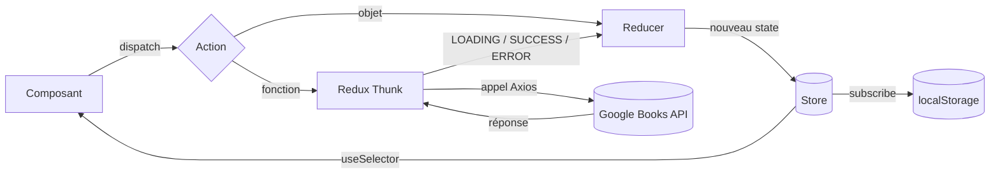

# 📚 Redux Bookshelf

> Gestionnaire de bibliothèque personnelle en **React + Redux** : ajoutez vos livres à la main ou recherchez-les via l'**API Google Books**, puis enregistrez-les dans votre étagère — persistée dans le navigateur.


## Sommaire

- [Contexte](#contexte)
- [Fonctionnalités](#fonctionnalités)
- [Stack technique](#stack-technique)
- [Architecture](#architecture)
- [Flux de données Redux](#flux-de-données-redux)
- [Installation](#installation)
- [Scripts disponibles](#scripts-disponibles)
- [Choix techniques](#choix-techniques)
- [Pistes d'amélioration](#pistes-damélioration)
- [License](#license)
- [Auteur](#auteur)


---

## Contexte

Projet réalisé dans le cadre d'un TP *« Implémentation d'une application React avec Redux »*.

L'objectif pédagogique est de maîtriser le **Redux « classique »** (sans Redux Toolkit) : store, reducers, action creators, `combineReducers` et gestion des actions asynchrones avec le middleware **Redux Thunk**. Les dépendances ont été montées sur leurs versions actuelles plutôt que celles de l'énoncé.

## Fonctionnalités

**Ma bibliothèque (`/`)**
- Ajout d'un livre (titre + auteur) avec validation des champs vides
- Suppression d'un livre ou de toute la bibliothèque
- Persistance automatique dans le `localStorage`
- Animations d'ajout / suppression (AutoAnimate)

**Recherche (`/search`)**
- Recherche de livres via l'API Google Books (20 résultats)
- États de chargement (spinner) et d'erreur gérés dans le store
- Affichage détaillé en accordéon : couverture, auteurs, description, lien Google Books
- Enregistrement d'un résultat dans la bibliothèque, avec notification toast

## Stack technique

| Domaine | Outil | Rôle |
|---|---|---|
| UI | React 19 | Composants et hooks |
| État global | Redux 5 + React-Redux 9 | Store centralisé, `useSelector` / `useDispatch` |
| Asynchrone | Redux Thunk 3 | Actions asynchrones (appels API) |
| Routage | React Router 8 | Navigation entre bibliothèque et recherche |
| HTTP | Axios | Requêtes vers Google Books |
| Style | Bootstrap 5.3 + Sass | Mise en page responsive |
| UX | AutoAnimate, React-Toastify | Animations et notifications |
| Identifiants | uuid | Clés uniques des livres |
| Build | Vite 8 | Serveur de dev et bundling |

## Architecture

```
src/
├── components/          # Composants de présentation (reçoivent des props)
│   ├── Book.jsx
│   ├── NavBar.jsx
│   └── SearchResult.jsx
├── containers/          # Composants connectés au store Redux (pages)
│   ├── AddBooks.jsx
│   └── SearchBooks.jsx
├── redux/
│   ├── actions/
│   │   ├── actionAddBooks.js     # add / delete / deleteAll
│   │   └── actionFetchBooks.js   # thunk d'appel à Google Books
│   ├── reducers/
│   │   ├── reducerAddBooks.js    # slice "library"
│   │   └── reducerFetchBooks.js  # slice "search"
│   ├── constants.js              # types d'actions
│   └── store.js                  # combineReducers + Thunk + DevTools
├── scss/styles.scss
├── App.jsx                       # Routes
└── main.jsx                      # Provider Redux
```

Le projet suit le pattern **Containers / Components** : les *containers* lisent le store et dispatchent des actions, les *components* se contentent d'afficher ce qu'ils reçoivent en props.

Le state global est découpé en deux branches :

```js
{
  library: [{ id, title, author }, ...],          // bibliothèque persistée
  search:  { isLoading, fetchedBooks, error }     // état de la requête API
}
```

## Flux de données Redux



## Installation

### Prérequis

- [Node.js](https://nodejs.org/) (version LTS recommandée)
- Une clé API Google Books ([Google Cloud Console](https://console.cloud.google.com/) → activer *Books API* → créer une clé)

### Étapes

```bash
# 1. Cloner le dépôt
git clone https://github.com/HNGA91/Redux_Bookshelf.git
cd Redux_Bookshelf

# 2. Installer les dépendances
npm install

# 3. Créer le fichier d'environnement
cp .env.example .env.local
```

Renseigne ensuite ta clé dans `.env.local` :

```env
VITE_GOOGLE_API_KEY=ta_cle_api
```

```bash
# 4. Lancer le serveur de développement
npm run dev
```

L'application est disponible sur [http://localhost:8080](http://localhost:8080).

> ⚠️ Le fichier `.env.local` est exclu du dépôt par le `.gitignore`. Attention toutefois : toute variable préfixée `VITE_` est **intégrée au bundle** et donc visible côté navigateur. En production, restreins la clé aux domaines autorisés depuis la Google Cloud Console.

## Scripts disponibles

| Commande | Description |
|---|---|
| `npm run dev` | Serveur de développement (port 8080) |
| `npm run build` | Build de production dans `dist/` |
| `npm run preview` | Prévisualisation du build |
| `npm run lint` | Analyse du code avec ESLint |

## Choix techniques

- **Redux sans Redux Toolkit** : choix imposé par le TP pour comprendre les mécanismes de base (immutabilité, reducers purs, middleware). D'où l'import de `legacy_createStore`, Redux 5 marquant `createStore` comme déprécié au profit de RTK.
- **Thunk pour l'asynchrone** : un action creator peut retourner une fonction qui reçoit `dispatch`, ce qui permet d'émettre successivement `LOADING`, puis `SUCCESS` ou `ERROR`. L'état de la requête vit ainsi dans le store et non dans le composant.
- **Persistance via `store.subscribe`** : la bibliothèque est sauvegardée à chaque changement d'état, et rechargée à l'initialisation du reducer (avec un `try/catch` en cas de données corrompues).
- **Robustesse face à l'API** : gestion de l'absence de `items` (aucun résultat), des champs manquants (auteurs, description, couverture) et forçage des images en `https`.
- **Accessibilité** : `aria-expanded` sur l'accordéon, `aria-label` sur les boutons de suppression, texte alternatif sur les couvertures.

## Pistes d'amélioration

- [ ] Migration vers **Redux Toolkit** (`configureStore`, `createSlice`, `createAsyncThunk`)
- [ ] Passage en **TypeScript**
- [ ] Éviter les doublons lors de l'enregistrement d'un livre
- [ ] Debounce / pagination de la recherche
- [ ] Tests unitaires des reducers (Vitest)
- [ ] Déploiement (Vercel, Netlify ou GitHub Pages)

## License

© 2026 Louis-Hervé N'Goma — Tous droits réservés.

Ce projet est publié à titre de démonstration dans le cadre de mon portfolio. Le code peut être consulté librement, mais aucune réutilisation, modification ou distribution n'est autorisée sans mon accord écrit. Voir le fichier [LICENSE](./LICENSE) pour plus de détails.

## Auteur

**Louis-Hervé N'Goma** — Développeur Full Stack
GitHub : [@HNGA91](https://github.com/HNGA91)
